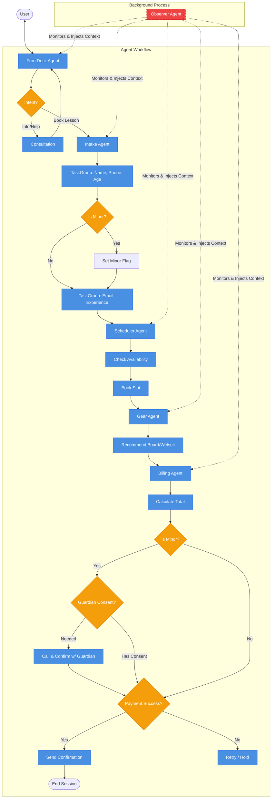

# Doheny Surf Desk - Surf School Booking Agent

A voice-based surf lesson booking system demonstrating **background observer agents**, **typed tasks**, and **task groups** using LiveKit Agents.

## What This Demo Shows

This example demonstrates three key patterns:

### 1. Background Observer Agent

The **ObserverAgent** runs in parallel with the main conversation flow. It monitors the conversation without blocking the user, using a (simulated) slower, more capable LLM to analyze safety compliance and inject context/hints back into the main agent's stream.

### 2. Sequential Task Groups

Shows how to execute multiple tasks in sequence with structured return values using `TaskGroup`.
For more information, see the [LiveKit Agents TaskGroup documentation](https://docs.livekit.io/agents/build/tasks/#taskgroup).

### 3. Typed Tasks with Structured Results

Demonstrates tasks that return structured data objects instead of strings, making it easier to extract and use results programmatically.

## Agent Overview

The system includes five main agents and one parallel observer:

1. **FrontDeskAgent** - Greets customers and routes them to booking or provides consultation.
2. **IntakeAgent** - Collects customer profile through sequential TaskGroup (5 tasks).
3. **SchedulerAgent** - Books lesson time slots with instructor availability.
4. **GearAgent** - Recommends surfboard and wetsuit based on measurements.
5. **BillingAgent** - Processes payment and sends confirmation via tasks.
6. **ObserverAgent** (Background) - Monitors for safety/compliance and injects context.

## Key Features Demonstrated

### 1. Typed Tasks with Structured Results

Tasks complete with structured return values instead of strings:

```python
# ConsentTask returns structured data
consent_result = await ConsentTask(chat_ctx=self.chat_ctx)
if consent_result.approved:
    print(f"Guardian: {consent_result.guardian_name}")

# NotificationTask returns delivery status
notification_result = await NotificationTask(chat_ctx=self.chat_ctx)
if notification_result.delivered:
    print(f"Sent via {notification_result.channel}")
```

### 2. Sequential Task Groups

The IntakeAgent uses `TaskGroup` to execute 5 tasks sequentially:

```python
task_group = TaskGroup()
task_group.add(lambda: NameTask(), id="name_task")
task_group.add(lambda: PhoneTask(), id="phone_task")
# ... other tasks ...

results = await task_group
# Access results by task ID
name = results.task_results["name_task"].name
```

### 3. Parallel Observer with Context Injection

The **ObserverAgent** evaluates conversation segments using an LLM to detect issues like:

- Minors (under 18) requiring consent
- Injury mentions
- Weather/safety concerns
- Skill mismatches

When triggered, it injects a system message into the active agent's context, prompting it to handle the situation (e.g., "Ask for guardian consent").

## Complete System Flow Diagram



## Prerequisites

- Python 3.11+
- `livekit-agents>=1.3.2`
- LiveKit account
- **OpenAI API Key**: Required for the ObserverAgent (which simulates a secondary "thinking" model) and for general agent inference if not using LiveKit Cloud's hosted models.

## Installation

1. Clone the repository

2. Install dependencies (using uv or pip):

   ```bash
   pip install -e .
   ```

3. Create a `.env` file with your credentials:
   ```env
   LIVEKIT_URL=your_livekit_url
   LIVEKIT_API_KEY=your_api_key
   LIVEKIT_API_SECRET=your_api_secret
   OPENAI_API_KEY=your_openai_key
   ```

## Running the Agent

```bash
cd complex-agents/doheny-surf-desk
python agent.py dev
```

Connect via the LiveKit Playground or a frontend client.

## Project Structure

```
doheny-surf-desk/
├── agent.py                    # Main entrypoint
├── agents/
│   ├── base_agent.py           # BaseAgent with handoff logic
│   ├── frontdesk_agent.py      # Consultation and routing
│   ├── intake_agent.py         # Profile collection (task-based)
│   ├── scheduler_agent.py      # Booking management
│   ├── gear_agent.py           # Equipment recommendations
│   ├── billing_agent.py        # Payment & finalization (task-based)
│   └── observer_agent.py       # Parallel guardrails (LLM-based)
├── tasks/
│   ├── name_task.py            # Name collection
│   ├── phone_task.py           # Phone with confirmation
│   ├── age_task.py             # Age + minor detection
│   ├── email_task.py           # Email validation
│   ├── experience_task.py      # Experience level
│   ├── consent_task.py         # Guardian consent for minors
│   ├── payment_details_task.py # Credit card collection
│   └── notification_task.py    # SMS/email confirmation
├── tools/
│   ├── calendar_tools.py       # Mock availability
│   ├── tide_tools.py           # Mock surf conditions
│   └── payment_tools.py        # Mock payment processing
├── prompts/
│   └── *.yaml                  # Agent instructions
├── mock_data.py                # Mock validators & responses
├── utils.py                    # Helper functions
└── pyproject.toml             # Project dependencies
```

## Observer Agent Details

The **ObserverAgent** demonstrates the "Observer Pattern":

- **Main Agent**: Fast, responsive, handles conversation flow.
- **Observer**: Runs analysis in parallel, can use more powerful (slower) models without blocking the user.

**How it works:**

1. **Event Listening**:

   ```python
   @self.session.on("conversation_item_added")
   def conversation_item_added(event):
       self.conversation_history.append(event.item)
       if len(new_segments) >= 3:
           asyncio.create_task(self._evaluate_with_llm())
   ```

2. **LLM Evaluation**:
   The observer builds a prompt with the recent conversation history and asks the LLM to detect specific triggers (minors, injuries, etc.) returning a JSON object.

3. **Context Injection**:
   ```python
   async def _send_guardrail_hint(self, severity, trigger, hint):
       current_agent = self.session.current_agent
       ctx_copy = current_agent.chat_ctx.copy()
       ctx_copy.add_message(
           role="system",
           content=f"[GUARDRAIL ALERT - {severity}]: {trigger}\n\n{hint}"
       )
       await current_agent.update_chat_ctx(ctx_copy)
   ```
