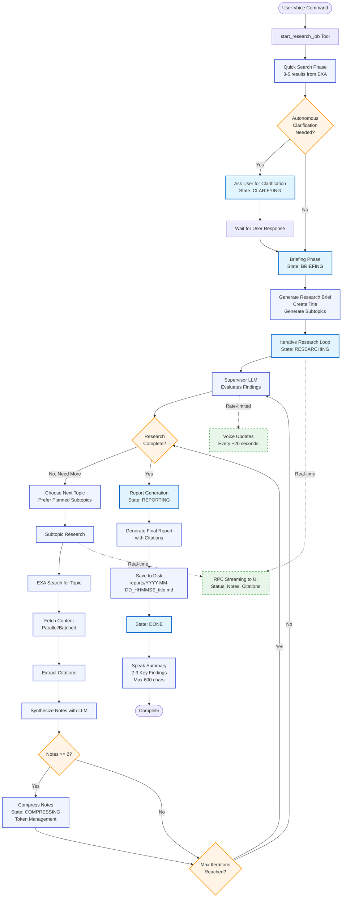

# EXA Deep Researcher

A voice-controlled deep research agent that uses [EXA](https://exa.ai) for web intelligence. The agent runs comprehensive research jobs in the background while remaining conversationally available, streaming progress to a UI and saving cited reports to disk.

## Overview

**ExaResearchAgent** - An AI-powered voice agent that conducts deep research on any topic using EXA's search capabilities. Simply tell it what to research using natural voice commands, and it will gather information from across the web, synthesize findings, and generate a comprehensive markdown report with inline citations.

## Features

- **Voice-Only Control**: Start and cancel research using natural voice commands
- **Single Background Job**: One active research job at a time with full state management
- **EXA Integration**: Leverages EXA's search, contents, and similarity APIs with full parameter support
- **Real-time Streaming**: Progress, notes, and sources streamed to UI via RPC
- **Smart Compression**: Token-aware compression to handle large research contexts
- **Cited Reports**: Comprehensive markdown reports with inline citations saved to disk
- **Concise Voice Updates**: Rate-limited spoken status updates that don't overwhelm the conversation
- **Built using LiveKit's AI Gateway** for seamless inference:
  - Speech-to-Text (STT)
  - Large Language Model (LLM)
  - Text-to-Speech (TTS)
  - Voice Activity Detection (VAD)

## How It Works

1. User gives a voice command to research a topic (e.g., "Research the impact of CRISPR on gene therapy")
2. The agent starts a background research job while remaining available for conversation
3. The research workflow:
   - Creates a research brief and title
   - Decomposes the topic into subtopics using a supervisor LLM
   - For each subtopic:
     - Searches EXA for relevant sources
     - Fetches and analyzes content
     - Extracts citations and synthesizes notes
   - Applies smart compression to manage token limits
   - Generates a final report with citations
4. Progress and findings stream to the UI in real-time via RPC
5. The agent provides periodic voice updates (rate-limited to avoid overwhelming the conversation)
6. Final report is saved to disk and a summary is spoken to the user

### Research Flow Diagram



**State Transitions:** IDLE → CLARIFYING (optional) → BRIEFING → RESEARCHING → COMPRESSING (periodic) → REPORTING → DONE

**Key Features:**

- **Autonomous Clarification**: LLM evaluates if quick search results match user intent before expensive deep research
- **Supervisor Pattern**: Iterative loop where an LLM continuously evaluates findings and decides what to research next
- **Parallel Processing**: EXA content fetching happens in batches (configurable concurrency)
- **Smart Compression**: After 4+ notes, compress to manage token limits (optional for 2-3 notes)
- **Real-time Streaming**: All progress streams to UI via RPC while voice updates are rate-limited

## Prerequisites

- Python 3.10+
- `livekit-agents`>=1.0
- LiveKit account and credentials
- EXA API key (get one at [exa.ai](https://exa.ai))

## Installation

1. Clone the repository

2. Install dependencies:

   ```bash
   pip install -r requirements.txt
   ```

   Or using uv:

   ```bash
   uv sync
   ```

3. Create a `.env` file in the project root:

   ```bash
   # Required
   EXA_API_KEY=your_exa_api_key
   LIVEKIT_URL=wss://your-project.livekit.cloud
   LIVEKIT_API_KEY=your_livekit_api_key
   LIVEKIT_API_SECRET=your_livekit_api_secret

   # Optional - Environment (for dev/prod separation)
   DEV=1                    # Set DEV to any value to use dev agent name (exa-deep-researcher-dev)

   # Optional - Research Configuration
   EXA_MAX_ITERATIONS=3            # Max research subtopics (default: 3)
   EXA_DEFAULT_MAX_RESULTS=10      # Results per search (default: 10)
   EXA_MAX_CONCURRENT_FETCHES=3    # Parallel content fetches (default: 3)
   ```

> [!NOTE]
> **Dev/Prod Separation**: Set `DEV` to any value in your `.env` file to use the dev agent name (`exa-deep-researcher-dev`). This allows you to run dev and prod agents simultaneously without conflicts. The same variable should be set in both Python agent and frontend `.env.local` files.

## Running the Agent

Start the agent:

```bash
python complex-agents/exa-deep-researcher/agent.py dev
```

Then start the frontend (in a separate terminal):

```bash
cd complex-agents/exa-deep-researcher/frontend
pnpm install
pnpm dev
```

Open http://localhost:3000 in your browser and click "Start a conversation" to begin.

## Deploy to LiveKit Cloud

Deploy your agent to LiveKit Cloud for production use with automatic scaling and global availability.

### First-Time Setup

1. **Install LiveKit CLI**:

   ```bash
   curl -sSL https://get.livekit.io/cli | bash
   ```

2. **Authenticate with LiveKit Cloud**:

   ```bash
   lk cloud auth
   ```

3. **Create and deploy your agent**:
   ```bash
   lk agent create
   ```
   This generates `Dockerfile`, `.dockerignore`, and `livekit.toml` configuration files, then deploys your agent.

### Monitoring

After deployment:

- View logs: `lk agent logs`
- Check status: `lk agent status`
- Manage in dashboard: [cloud.livekit.io/projects/p\_/agents](https://cloud.livekit.io/projects/p_/agents)

For CI/CD deployment with GitHub Actions, see the [LiveKit Cloud Deployment Guide](https://docs.livekit.io/agents/ops/deployment/).

## Usage

### Example Interaction

```
User: "Research the latest developments in fusion energy"

Agent: "Starting deep research on: the latest developments in fusion energy.
        I'll keep you updated as I make progress!"

[Background research begins]

Agent: "Found 12 sources from Nature and MIT Technology Review"
       [20 seconds later]
       "Analyzing breakthrough from National Ignition Facility"

[Research completes]

Agent: "Research complete! Key findings: The National Ignition Facility
        achieved net energy gain in December 2022, marking a historic milestone.
        Multiple private companies are now racing toward commercial fusion with
        projected timelines of 2030-2035. The full report is on your screen."
```

## Architecture Details

### Components

1. **ExaResearchAgent**: Main voice agent with two function tools

   - `start_research_job(query, max_results?, include_domains?, exclude_domains?)`
   - `cancel_research_job()`

2. **JobManager**: Single-job state machine enforcing one active research at a time

   - States: idle → briefing → researching → compressing → reporting → done/canceled/error

3. **ResearchOrchestrator**: Background workflow coordinator

   - Clarify (optional) → Brief → Supervise → Research subtopics → Compress → Final report

4. **EXAClient**: REST API wrapper with retry logic and exponential backoff
   - Search with rich filters (type, category, country, dates, domains, text)
   - Contents with livecrawl options
   - Find similar pages

### Voice Policy

**Spoken Output:**

- Max length: 600 characters (~15-20 seconds)
- Status updates rate-limited to one every 20 seconds
- Completion summary: 2-3 key findings only
- No URLs in speech (refer to domains plainly)
- Natural language only (no markdown or technical jargon)

**UI Output:**

- Full reports with complete markdown and citations
- Real-time progress timeline
- Source content with on-demand fetching
- Clickable citations with quotes

## Customization

You can customize the agent by:

1. Modifying the agent instructions in `agent.py`
2. Adjusting research parameters in `.env` (max iterations, results per search, etc.)
3. Changing the LLM model or voice settings in the agent configuration
4. Adding custom EXA search filters (domains, date ranges, content types)

## Troubleshooting

**"No results found"**

- Check EXA API key is valid
- Try broader search terms
- Remove restrictive domain filters

**"Rate limited"**

- The agent automatically retries with exponential backoff
- Reduce `EXA_MAX_CONCURRENT_FETCHES` if hitting limits frequently

**Voice not working**

- Check LiveKit credentials are correct
- Verify microphone permissions in browser

**Reports not saving**

- Check write permissions on `reports/` directory
- Ensure disk space is available

## Related Examples

- [Note Taking Assistant](../note-taking-assistant/) - Real-time transcription and notes
- [Shopify Voice Shopper](../shopify-voice-shopper/) - Voice-controlled shopping with RPC
- [Medical Office Triage](../medical_office_triage/) - Multi-agent voice system

## Resources

- [EXA API Documentation](https://docs.exa.ai)
- [LiveKit Agents Documentation](https://docs.livekit.io/agents)
- [Function Tools Guide](https://docs.livekit.io/agents/build/tools)
- [RPC Documentation](https://docs.livekit.io/home/client/data/rpc)
